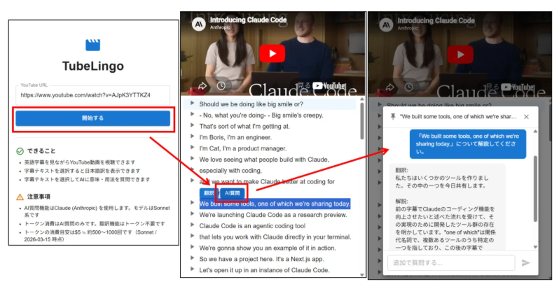
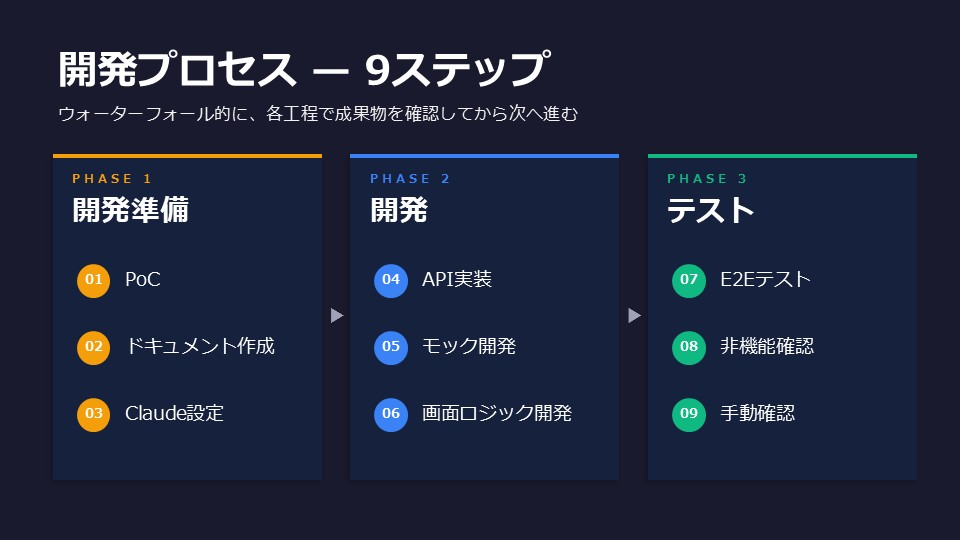
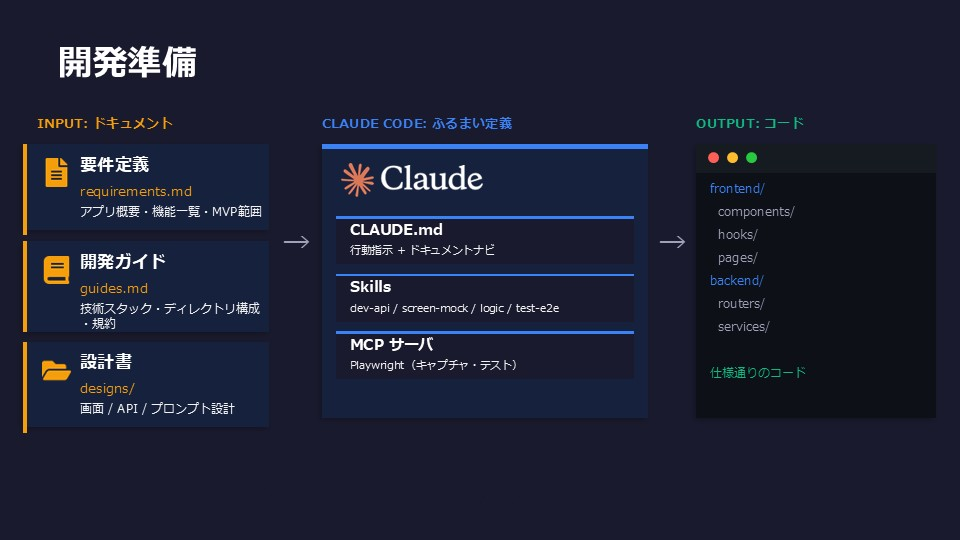

# 目次

- 背景
  - プロジェクト活動の概要
  - 今回の開発のテーマ
- 開発アプローチ
- 振り返り

# 背景

## プロジェクト活動

消費者金融企業向けに、合計6つのAIプロダクトを作るプロジェクト。

AIプロダクト例
- 不正申込チェックAIアプリ
- コールセンター社員研修用AIロールプレイングアプリ

設計書をマークダウンで作成、開発にCopilotを利用、などAIを活用している。

## 今回の開発のテーマ

プロジェクト活動でのAI活用方法をベースに、Claudeを使って英語学習アプリを開発した。
- YouTubeの字幕表示
- 字幕を選択して翻訳、AI質問ができる

主な目的はアプリの開発ではなく、**AI活用方法のテスト**  
- 生成AIをどのようにコントロールするか
- 効率的な開発プロセスを考える
- Claude Codeの各機能を試すこと

# 開発アプローチ

## 開発プロセス

1. 開発準備
   1. PoC
   2. ドキュメント作成
   3. CLAUDm設定
2. 開発
   1. API開発
   2. 画面モック開発
   3. 画面ロジック開発
3. テスト
   1. E2Eテスト
   2. 非機能確認
   3. 手動テスト

## 開発準備

### 1. Youtube字幕取得PoC

当初バックエンドも1つのプロジェクトで対応できるNext.jsを利用予定だったが、Nodeでは字幕取得がうまくいかず、Fast APIに変更

**Claude利用：** 実装パターンを複数調査させPoCを実行し、結果から実装方針を整理。ほぼお任せ

### 2. ドキュメント作成

- **requirements.md** — 要件定義。アプリ概要、機能一覧など
- **guides.md** — 開発ガイド。ディレクトリ構成、利用ライブラリなど
- **designs/** — 画面設計書、API設計書、プロンプト設計書を記載

**Claude利用：** チャットで壁打ちしながら作成

### 3. Skills・MCPツール・CLAUDE.md設定

- **CLAUDE.md** — Claudeへの行動指示とドキュメントナビゲーション

- **Skills**
  - dev-screen-mock — モック開発スキル
  - dev-screen-logic — 画面実開発スキル
  - dev-api — API開発スキル
  - test0e2e - Playwright E2Eテストスキル

- **MCPサーバ**
  - playwright - Playwright MCPサーバのセットアップ
    - `npm install -g @playwright/mcp` でplaywrightをインストール
    - `claude mcp add --scope project playwright -- npx @playwright/mcp@latest` でMCPサーバをClaudeに追加
    - `npx playwright install chromium` でchromiumを設定

**Claude利用：** チャットで壁打ちしながら作成

## 開発

### 4. API実装

1. Claudeで実装  
**Claude利用：** Plan modeでプランを立ててもらい、確認した後に実行

2. 手動でcurlコマンドによってテスト実行  
**Claude利用：** テストケースとテスト実行コマンドを作成

### 5. Reactアプリ立ち上げ + モック開発

1. モック開発  
**Claude利用：** Plan modeでプランを立ててもらい、確認した後に実行。dev-screen-mockスキルを利用

2. キャプチャをレビューして修正指示
3. アプリ修正して再度キャプチャ取得
4. 繰り返す（3回くらい実施）

### 6. 画面ロジック開発

1. 画面ロジック開発  
**Claude利用：** Plan modeでプランを立ててもらい、確認した後に実行。dev-screen-logicスキルを利用

2. キャプチャをレビューして修正指示
3. アプリ修正して再度キャプチャ取得
4. 繰り返す

## テスト

### 7. E2Eテスト

1. Playwright用のテストケースを作成
2. ケースレビュー
3. テスト実行
4. すべて成功するまでテストと修正を繰り返す

**Claude利用：** チャットで指示、Playwright（MCPサーバ）を利用

### 8. 非機能確認

- ソースコードを可読性や性能面からレビュー
- 必要に応じて修正
- 再度E2Eテスト

**Claude利用：** チャットで指示、MCP（Playwright）を利用

### 9. 手動確認

フロント側の動き、AIチャットポップアップ管理など一部時間がかかった。

# 振り返り

## PlaywrightMCPが非常に便利だった。

- 手動操作不要でキャプチャの取得ができる
- キャプチャがあることで、UI修正指示が出しやすい

> **参考：** Claude in ChromeでもChrome操作の自動化が可能だが、キャプチャ取得ができなかったためPlaywright MCPを採用した。一方、Claude in Chromeはユーザーが操作した後のブラウザをそのまま引き継げるため、「認証のみ手動→その後の操作は自動化」という使い方に向いている。

## インプットの質がアウトプットに直結

- 画面の状態を網羅的に画面設計書に記載できていなかった
- そのため、生成AIを使った実装やテストでは気づかず、手動テストで検出した。

## 誤ったプロンプトの利用

- 開発用プロンプトを含め、開発パイロットを行ったが、あまり技術に詳しくないアプリチームのスタッフが担当し、成果物の詳細な確認ができていなかった
- 結果、機能的には問題ないが、性能がかなり悪い実装になり、後から横展開で修正が発生した
- 開発プロンプトや開発手順は、リソースを割いてきっちり作るべき。
- また開発プロンプトやスキルなどの改善サイクルを確立すべき
